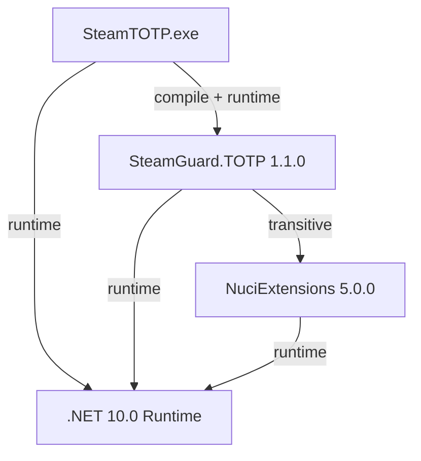

# SteamTOTP Architecture

This document describes the **current architecture** of the SteamTOTP repository as of the analysis date. It covers the system boundary, runtime flow, components, dependencies, deployment model, and verification approach.

## 📑 Table of Contents

- [Purpose](#-purpose)
- [System Context](#-system-context)
- [Architectural Style](#️-architectural-style)
- [Runtime Flow](#-runtime-flow)
- [Components](#-components)
- [Architectural Areas](#-architectural-areas)
- [Data Architecture](#-data-architecture)
- [Interfaces and Integrations](#-interfaces-and-integrations)
- [Cross-Cutting Concerns](#-cross-cutting-concerns)
- [Dependency Direction and Rules](#-dependency-direction-and-rules)
- [External Dependencies](#-external-dependencies)
- [Deployment and Operations](#-deployment-and-operations)
- [Compatibility Contracts](#️-compatibility-contracts)
- [Testing and Verification](#-testing-and-verification)
- [Design Constraints](#-design-constraints)
- [Source Map](#-source-map)
- [Related Documentation](#-related-documentation)

## 🎯 Purpose

SteamTOTP is a **minimalist, single-purpose .NET console application** that generates Steam Guard TOTP (Time-based One-Time Password) codes from a Base32-encoded shared secret. It serves as a thin CLI wrapper around the `SteamGuard.TOTP` NuGet library.

**Scope:**
- **Owns**: CLI argument handling, stdout output, process exit codes
- **Does not own**: TOTP algorithm, Base32 decoding, HMAC-SHA1 computation, time-step calculation (delegated to SteamGuard.TOTP)

**Audience:** Architects, maintainers, contributors, and security auditors.

**Value:** Documents the complete causal chain from CLI invocation to TOTP code output, including all failure modes, trust boundaries, and supply-chain dependencies.

## 🌐 System Context

```mermaid
flowchart LR
    User[User Shell] -->|argv[1] = shared_secret| SteamTOTP[SteamTOTP Process]
    SteamTOTP -->|stdout: 5-char code + LF| User
    SteamTOTP -->|stderr: unhandled exceptions| User
    SteamTOTP -->|exit code| User
    SteamTOTP -->|in-process call| SteamGuard[SteamGuard.TOTP Library]
    SteamGuard -->|uses| NuciExt[NuciExtensions 5.0.0]
    SteamTOTP -.->|requires| DotNet[.NET 10.0 Runtime]
```

The principal external boundaries are:
- **User Shell (CLI):** Initiates process, supplies shared secret via `argv[1]`, receives 5-character code on stdout, exceptions on stderr, exit code
- **SteamGuard.TOTP (NuGet library):** In-process dependency providing `GenerateAuthenticationCode(string)`; owns TOTP algorithm per RFC 6238 with Steam charset
- **NuciExtensions 5.0.0 (NuGet library):** Transitive utility library used by SteamGuard.TOTP
- **.NET 10.0 Runtime:** Execution platform providing BCL, cryptography primitives, and process hosting

## 🏗️ Architectural Style

**Style:** Single-file console utility / Thin CLI wrapper / Stateless deterministic function

**Implementation:**
- Single source file (`Program.cs`, ~10 lines)
- Direct dependency on concrete `SteamGuard` class (no abstraction layer)
- No internal layering, no dependency injection, no configuration system
- Single-file, trimmed, self-contained publish (`PublishSingleFile=true`, `PublishTrimmed=true`)

**Consequences:**
- Zero architectural indirection — trivial to audit
- No testability seams — time source (`DateTimeOffset.UtcNow`) embedded in library
- All failures surface as unhandled exceptions — no graceful degradation
- Supply chain limited to two NuGet packages (one direct, one transitive)

```mermaid
flowchart TB
    subgraph SteamTOTP_Process
        Main[Program.Main]
        Console[Console.WriteLine]
    end
    Main -->|args[0]| SteamGuard[SteamGuard.TOTP.GenerateAuthenticationCode]
    SteamGuard -->|uses| NuciExt[NuciExtensions]
    SteamGuard -->|returns| Code[5-char string]
    Code --> Console
    Console --> Stdout[stdout]
```

The principal architecture boundaries are:
- **Application Boundary (`Program.cs`):** Owns `Main`, argument access, stdout write; no other responsibilities
- **Library Boundary (`SteamGuard.TOTP`):** Owns TOTP algorithm, Base32 decode, HMAC-SHA1, time-step, Steam charset mapping
- **Utility Boundary (`NuciExtensions`):** Provides utility functions consumed by SteamGuard.TOTP

## 🔄 Runtime Flow

```mermaid
flowchart TD
    Start[Process Start] --> ArgCheck{args.Length >= 1?}
    ArgCheck -- No --> Crash1[IndexOutOfRangeException\nExit 139/1]
    ArgCheck -- Yes --> NewGuard[new SteamGuard()]
    NewGuard --> GenCode[GenerateAuthenticationCode(args[0])]
    GenCode --> SecretCheck{secret valid?}
    SecretCheck -- Null --> Crash2[NullReferenceException\nExit 1]
    SecretCheck -- Empty --> Crash3[InvalidOperationException\nExit 1]
    SecretCheck -- Invalid Base32 --> Crash4[FormatException\nExit 1]
    SecretCheck -- Valid --> Compute[HMAC-SHA1 + Truncation + Charset Map]
    Compute --> Code[5-char string]
    Code --> Write[Console.WriteLine]
    Write --> Stdout[stdout: XXXXX\n]
    Stdout --> Exit0[Exit 0]
```

The principal runtime sequence is:
1. **Process startup** — .NET runtime loads single-file trimmed binary
2. **Argument access** — `args[0]` read without bounds check
3. **Library instantiation** — `new SteamGuard()` allocates default `TimeStepProvider`
4. **TOTP computation** — `GenerateAuthenticationCode` performs Base32 decode, HMAC-SHA1, dynamic truncation, Steam charset mapping
5. **Output** — `Console.WriteLine` writes 5-character code + LF to stdout
6. **Process exit** — Exit code 0 on success; non-zero on unhandled exception

## 🧩 Components

| Component | Responsibility | Principal Dependencies | Lifetime or Ownership |
|-----------|----------------|------------------------|-----------------------|
| `Program.Main` | Entry point, argument access, stdout output | `SteamGuard.TOTP.SteamGuard`, `System.Console` | Per-invocation, owned by process |
| `SteamGuard.TOTP.SteamGuard` | TOTP algorithm (RFC 6238 + Steam charset) | `NuciExtensions`, `System.Security.Cryptography` | Per-invocation, instantiated by `Main` |
| `SteamGuard.TOTP.DefaultTimeStepProvider` | Time-step calculation (`UtcNow / 30s`) | `System.DateTimeOffset` | Singleton per `SteamGuard` instance |
| `NuciExtensions` | Utility functions for SteamGuard.TOTP | .NET BCL | Transitive, loaded by assembly resolver |

## 🗂️ Architectural Areas

### Application Entry Point
Paths:
- `SteamTOTP/Program.cs`

Responsibilities:
- Process entry point (`Main`)
- CLI argument access (`args[0]`)
- Stdout output (`Console.WriteLine`)

Boundary rules:
- No argument validation (by design, currently)
- No error handling (by design, currently)
- Direct dependency on concrete `SteamGuard` class

### External Library Integration
Paths:
- `SteamTOTP/SteamTOTP.csproj` (PackageReference)

Responsibilities:
- Declare dependency on `SteamGuard.TOTP 1.1.0`
- Configure single-file trimmed publish

Boundary rules:
- No version pinning beyond `1.1.0` (floating patch not used)
- No private NuGet sources

## 💾 Data Architecture

```mermaid
flowchart LR
    Secret[CLI Argument\nBase32 String] --> Decode[Base32 Decode\n→ byte[]]
    Decode --> HMAC[HMAC-SHA1\nkey=secret, data=timeStep]
    HMAC --> Truncate[Dynamic Truncation\nRFC 4226 → int]
    Truncate --> Map[Steam Charset Map\n23456789BCDFGHJKMNPQRTVWXY]
    Map --> Code[5-char String]
    Code --> Stdout[stdout + LF]
```

| Data or Store | Owner | Representation and Storage | Lifecycle or Consistency |
|---------------|-------|----------------------------|--------------------------|
| CLI Argument (`args[0]`) | `Program.Main` | `string` on stack | Immutable per invocation, no persistence |
| Decoded Secret (`byte[]`) | `SteamGuard.TOTP` | Heap-allocated `byte[]` | Transient, exists only during `GenerateAuthenticationCode` call |
| Time Step (`long`) | `DefaultTimeStepProvider` | `long` (Unix seconds / 30) | Read-only, derived from `DateTimeOffset.UtcNow` |
| HMAC-SHA1 Hash (`byte[20]`) | `SteamGuard.TOTP` | Heap-allocated `byte[]` | Transient, single-use per invocation |
| Output Code (`string`) | `SteamGuard.TOTP` → `Program.Main` | `string` (5 chars) | Transient, written to stdout immediately |

**No application-managed persistent state.** All state is either input arguments or system time.

## 🔌 Interfaces and Integrations

| Interface or Integration | Direction | Contract | Owner | Failure Semantics |
|--------------------------|-----------|----------|-------|-------------------|
| CLI Arguments (`argv`) | Inbound | `string[] args`; `args[0]` = Base32 secret | `Program.Main` | `IndexOutOfRangeException` if missing |
| `SteamGuard.GenerateAuthenticationCode(string)` | Outbound (in-process) | Returns 5-char Steam TOTP code; throws on invalid input | `SteamGuard.TOTP` | `NullReferenceException`, `InvalidOperationException`, `FormatException` |
| `Console.WriteLine(string)` | Outbound (OS stream) | Writes UTF-8 + LF to stdout | `System.Console` | `IOException` (rare, unhandled) |
| Process Exit Code | Outbound (OS) | `0` = success, non-zero = failure | .NET Runtime | Propagates unhandled exception HRESULT |

## 🧵 Cross-Cutting Concerns

### Security and Privacy

**Trust Boundaries:**
```
User Input (secret) ──▶ Process Memory ──▶ SteamGuard.TOTP ──▶ stdout
      │                    │                    │
      ▼                    ▼                    ▼
  Untrusted          Transient            Trusted library
  (CLI arg)          (decoded bytes)      (GPLv3, same author)
```

- **Secret enters via CLI argument** — visible in process table (`ps aux`), shell history
- **Secret decoded in memory** — Base32 → `byte[]` → HMAC key
- **No secret logging** — library doesn't log; app doesn't log
- **No secret persistence** — purely transient in-memory

### Error Handling

**Zero try/catch blocks in application code.** All failures propagate as unhandled exceptions:

| Trigger | Exception Type | Exit Code | User Visibility |
|---------|----------------|-----------|-----------------|
| No arguments | `IndexOutOfRangeException` | 139 (SIGSEGV) / 1 | Unhandled exception stack trace |
| Empty string secret | `InvalidOperationException` | 1 | Unhandled exception stack trace |
| Invalid Base32 secret | `FormatException` | 1 | Unhandled exception stack trace |
| Null secret | `NullReferenceException` | 1 | Unhandled exception stack trace |
| Trimmed publish removes required type | `MissingMethodException` | 1 | Unhandled exception stack trace |

**No graceful error handling exists** — all failures surface as unhandled exceptions with stack traces to stderr.

### Observability

- **No structured logging** — no `ILogger`, no `Console.Error` usage
- **No metrics** — no counters, gauges, histograms
- **No traces** — no `ActivitySource`, no distributed tracing
- **No health checks** — not a long-running service
- **Diagnostic output** — only unhandled exception stack traces on stderr

### Configuration

| Configuration Area | Source | Responsibility | Override or Secret Policy |
|--------------------|--------|----------------|---------------------------|
| Target Framework | `SteamTOTP.csproj` (`TargetFramework`) | Determines .NET version compatibility | Build-time only |
| Publish Mode | `SteamTOTP.csproj` (`PublishSingleFile`, `PublishTrimmed`) | Single-file trimmed binary | Build-time only |
| Dependency Versions | `SteamTOTP.csproj` (`PackageReference`) | SteamGuard.TOTP version | Build-time, locked via `project.assets.json` |
| .NET Version (CI) | `.github/workflows/dotnet.yml` (`dotnet-version`) | CI runner SDK version | CI-time only |
| .NET Version (Release) | `release.sh` (`DOTNET_VERSION`) | Release script SDK version | Release-time only |

**No runtime configuration** — no `appsettings.json`, no environment variables, no command-line flags beyond the secret argument.

### Concurrency and Resource Use

- **Single-threaded** — no concurrency, no `Task`, no `async`/`await`
- **Stateless** — no shared state between invocations
- **Short-lived** — executes in <100ms typically
- **Memory** — minimal allocations (secret `byte[]`, HMAC `byte[20]`, code `string`)
- **No resource pooling** — no `HttpClient`, no database connections, no handles held

## 🧭 Dependency Direction and Rules



The principal dependency rules are:
- **Application → Libraries** — `SteamTOTP` depends on `SteamGuard.TOTP`; no reverse dependency
- **Direct → Transitive** — `SteamGuard.TOTP` depends on `NuciExtensions`; `SteamTOTP` does not directly reference `NuciExtensions`
- **No circular dependencies** — strict acyclic graph
- **No internal abstractions** — `Program.Main` calls concrete `SteamGuard` class directly
- **No dependency injection** — no `IServiceCollection`, no factories, no interfaces defined by application

## 📦 External Dependencies

| Dependency | Responsibility | Integration Boundary | Architectural Consequence |
|------------|----------------|----------------------|---------------------------|
| `SteamGuard.TOTP 1.1.0` | TOTP algorithm (RFC 6238 + Steam charset) | Direct in-process call from `Program.Main` | Algorithm parameters fixed (5 digits, SHA1, 30s, Steam charset); no abstraction for testing |
| `NuciExtensions 5.0.0` | Utility functions for SteamGuard.TOTP | Transitive, loaded by assembly resolver | Same author (hmlendea); version locked by SteamGuard.TOTP |
| `.NET 10.0 Runtime` | Execution platform, BCL, cryptography | Process host | Requires .NET 10.0 runtime on target machine; self-contained publish includes runtime |
| `GitHub Actions (ubuntu-latest)` | CI execution environment | External service | Unpinned actions (`v2`, `v1`); supply chain risk |
| `deployment-scripts/dotnet/10.0.sh` | Release automation (version bump, tag, GitHub Release, asset upload) | External script downloaded at release time | **High supply chain risk** — executes remote code via `wget \| bash` |

## 🚀 Deployment and Operations

| Concern | Current Design | Architectural Consequence |
|---------|----------------|---------------------------|
| Process Topology | Single console process, no child processes | Trivial deployment, no orchestration |
| Deployment Unit | Single-file self-contained executable (~14 MB on linux-arm64) | No runtime installation required on target; architecture-specific |
| Persistent State | None | No backup, migration, or state recovery needed |
| Filesystem Requirements | None (reads no files, writes no files) | Runs from any directory, no permissions beyond execute |
| Network Requirements | None at runtime | Fully offline-capable; only CI/release need network |
| Scaling | N/A (single invocation per process) | Horizontal scaling via parallel invocations |
| Startup | <100ms cold start (trimmed single-file) | Suitable for high-frequency scripting |
| Shutdown | Immediate on `Main` return | No graceful shutdown logic needed |
| Operator Outputs | Stdout: 5-char code + LF; Stderr: exception stack traces only | Machine-parseable stdout; human-readable stderr |

## 🛡️ Compatibility Contracts

| Contract | Owner | Invariant | Verification | Change Policy |
|----------|-------|-----------|--------------|---------------|
| CLI Argument Position | `Program.Main` | `args[0]` = Base32 secret | Manual testing | Breaking — would require version bump |
| Stdout Format | `Program.Main` | Exactly 5 chars from `23456789BCDFGHJKMNPQRTVWXY` + LF | Manual testing | Breaking — would break automation |
| Exit Code Semantics | .NET Runtime | `0` = success, non-zero = failure | Manual testing | Stable — follows POSIX convention |
| SteamGuard.TOTP API | `SteamGuard.TOTP` | `GenerateAuthenticationCode(string)` signature | Compile-time | Library-controlled; test on upgrade |
| TOTP Algorithm Parameters | `SteamGuard.TOTP` | 5 digits, SHA1, 30s step, Steam charset | Library tests (if any) | Library-controlled; verify on upgrade |

## ✅ Testing and Verification

**Current State:** No tests exist in this repository.
- No `*Tests.cs` files
- No test projects (`*.Tests.csproj`)
- CI runs `dotnet test` but produces: "No test matches the given test filter"
- No test frameworks referenced (xUnit, NUnit, MSTest, TUnit)

**Verification Commands:**
```bash
# Build verification
dotnet build

# Functional verification (manual)
dotnet run -- <valid_base32_secret>
# Expected: 5-char code on stdout, exit 0

# Error behavior verification (manual)
dotnet run --
# Expected: IndexOutOfRangeException, exit 139/1

dotnet run -- ''
# Expected: InvalidOperationException, exit 1

dotnet run -- 'INVALID'
# Expected: FormatException, exit 1

# Publish verification
dotnet publish -c Release
# Expected: Single-file binary in bin/Release/net10.0/<rid>/publish/

# Published binary verification
./bin/Release/net10.0/<rid>/publish/SteamTOTP <valid_base32_secret>
# Expected: 5-char code on stdout, exit 0
```

**Material Coverage Gaps:**
- No unit tests for argument validation (currently absent)
- No integration tests for CLI behavior
- No deterministic time-window tests (requires time abstraction in SteamGuard.TOTP)
- No known test vector validation
- No CI test stage with meaningful assertions

## 🎯 Design Constraints

| Constraint | Description | Rationale or Trade-off |
|------------|-------------|------------------------|
| Single source file | `Program.cs` only (~10 lines) | Minimalism, auditability; limits extensibility |
| No argument validation | Crashes on missing/invalid input | Simplicity; shifts burden to caller |
| No error handling | All exceptions unhandled | Simplicity; relies on OS process semantics |
| Direct library dependency | No adapter/interface | Zero indirection; prevents testability |
| Embedded time source | `DateTimeOffset.UtcNow` in library | Simplicity; prevents deterministic testing |
| Single-file trimmed publish | `PublishSingleFile=true`, `PublishTrimmed=true` | Small deployment (~14 MB); risk of trimmer removing required types |
| External release script | `wget \| bash` from GitHub | Convenience; **high supply chain risk** |
| Unpinned GitHub Actions | `actions/checkout@v2`, `actions/setup-dotnet@v1` | Convenience; supply chain risk |
| No tests | Zero test coverage | Minimalism; high regression risk |

## 🔧 Extension Points

**No intentional extension points exist.** The architecture is deliberately closed:
- No plugin system
- No configuration hooks
- No interface for alternative TOTP implementations
- No middleware pipeline

**Potential extension points (would require architectural change):**
- `ITotpGenerator` interface + adapter for `SteamGuard` (enables testing, alternative implementations)
- `ITimeStepProvider` injection (enables deterministic time testing)
- Argument parsing library (enables flags, help, validation)
- Structured logging abstraction (enables observability)

## 📂 Source Map

| Area | Repository-Relative Path |
|------|--------------------------|
| Application Entry Point | `SteamTOTP/Program.cs` |
| Project Configuration | `SteamTOTP/SteamTOTP.csproj` |
| Solution | `SteamTOTP.slnx` |
| CI Pipeline | `.github/workflows/dotnet.yml` |
| Release Automation | `release.sh` |
| Documentation | `docs/` (architecture.md, capabilities.md, implementation.md, dependencies.md, testing.md, README.md) |
| User Documentation | `README.md` |
| License | `LICENSE` |
| Funding | `.github/FUNDING.yml` |

## 📚 Related Documentation

| Document | Scope | Relationship |
|----------|-------|--------------|
| `docs/architecture.md` | Detailed architecture with invariants, failure modes | Complements this document; more implementation detail |
| `docs/capabilities.md` | Single capability specification with execution flows | Describes the one capability this architecture delivers |
| `docs/implementation.md` | Source code details, call graphs, build artifacts | Implementation-level view of the same architecture |
| `docs/dependencies.md` | Dependency graph, versions, licenses, vulnerabilities | Supply-chain view of external dependencies |
| `docs/testing.md` | Test strategy, recommended cases, CI integration, gaps | Verification view of the architecture |
| `README.md` | User-facing documentation | Installation, usage, development workflow |
| `LICENSE` | GPLv3 license text | Legal boundary |